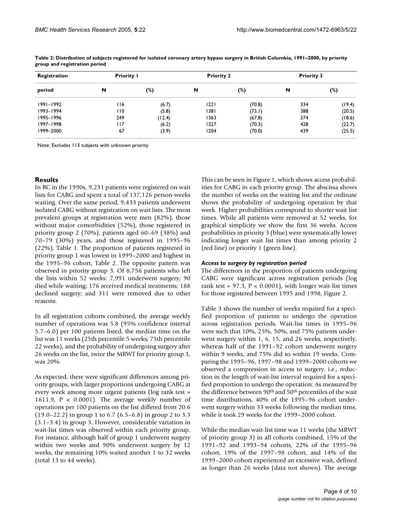
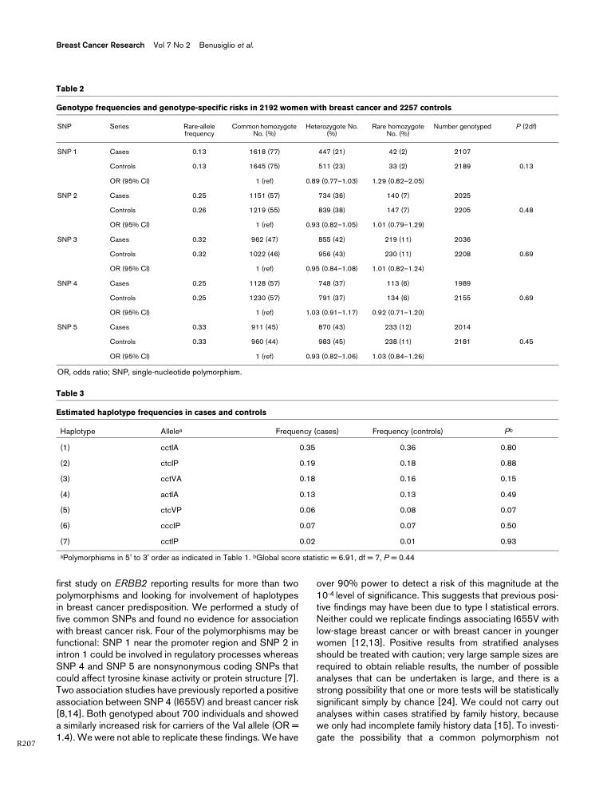
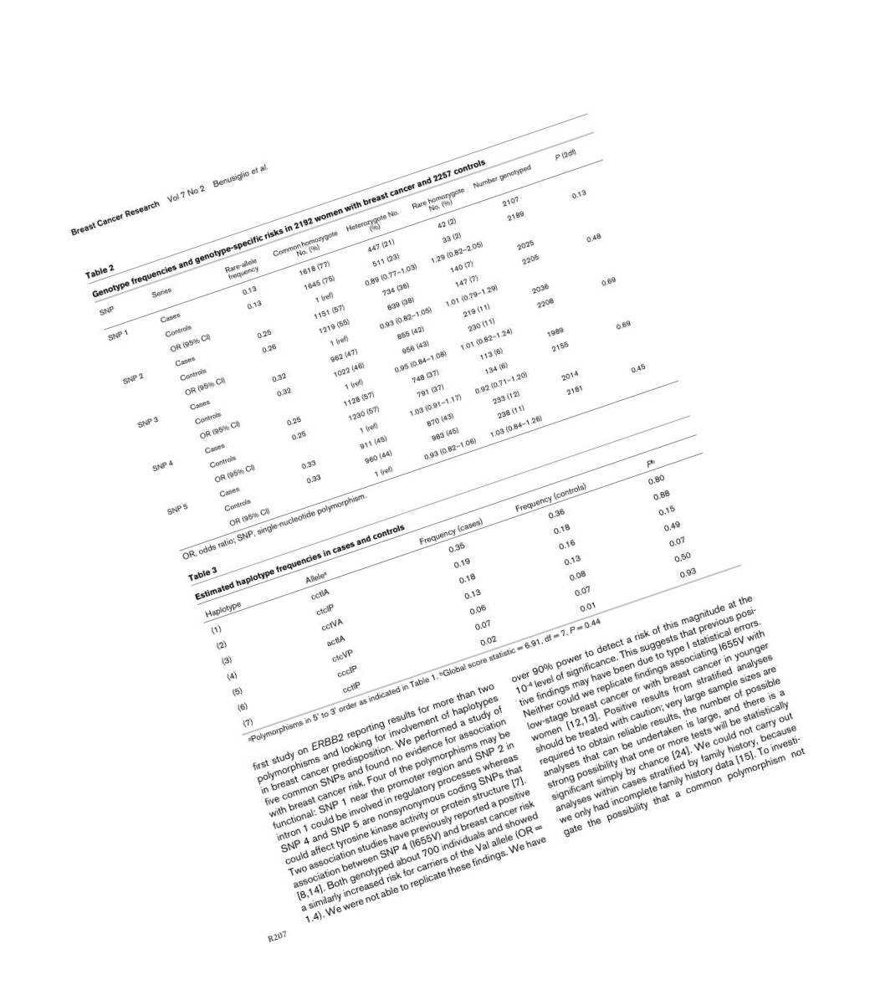

# Tabular Data Detection and Extraction

<p align="center">
  
  <br>
  image1.jpg
</p>

<p align="center">
  
  <br>
  image2.jpg
</p>

<p align="center">
  
  <br>
  image3.jpg
</p>


### SkewML
```
!git clone --depth=1 https://github.com/sreesankar711/TabDetExt.git tmp_folder
!mv tmp_folder/* .
!rm -rf tmp_folder
```


### Backend
```
cd backend
flask --app final3 run
```

### Frontend
```
cd frontend
npm start
```
